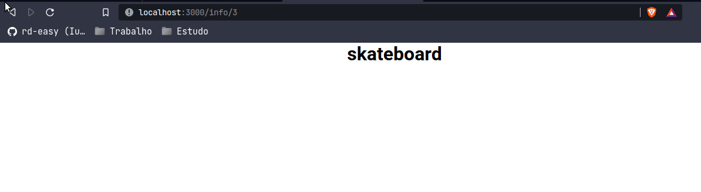

<br>
<div align="center">
  
    <span align="center">
      URL 'info/id/
    </span>
  
  <span align="center">
      URL 'persinal/id/
    </span>

  <h4 align="center">
     Para afins de aprendizado de next.js
  </h4>
</div>

---

## 🚀 Getting started

To clone and run the application, you will need to have [Git](https://git-scm.com), [Node.js](https://nodejs.org) + [Yarn](https://yarnpkg.com) installed on your machine. With all programs installed, run the following command lines:


```bash
# Clone this repository
$ git clone https://github.com/rd-easy/studing-next.git

# Access the repository
$ cd studing-next

# Install the dependencies
$ yarn install

# Run application
$ yarn serve && yarn dev

#Run application (prod)
$ yarn serve && yarn build
$ yarn start
```

